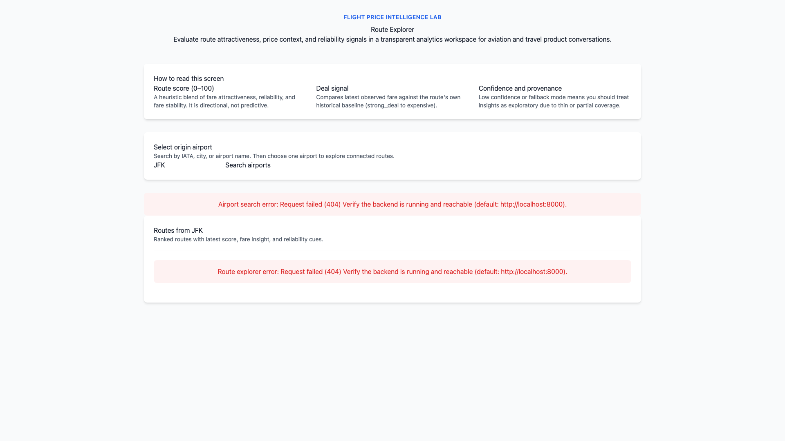

# Immediate Next Steps - Phase 1 Completion

**Status:** Deployment fix prepared, awaiting user action  
**Time estimate:** 30-60 minutes remaining

---

## ✅ COMPLETED (Automated)

1. **Deployment diagnosis** ✅
   - Identified root cause: Vercel deploying from wrong directory
   - Created `vercel.json` configuration
   - Verified local build succeeds

2. **Documentation upgrades** ✅
   - Created `DEPLOYMENT_FIX.md` (deployment troubleshooting)
   - Created `README_NEW.md` (9KB project-specific showcase)
   - Created `NEXT_STEPS.md` (this file)

3. **Build verification** ✅
   - Tested `npm run build` in frontend/
   - Result: Clean build, no errors

---

## 🚨 REQUIRES USER ACTION

### Step 1: Fix Vercel Deployment (15-30 min)

**Option A: Vercel Dashboard** (Recommended)
1. Go to https://vercel.com/dashboard
2. Find `flight-price-intelligence-lab` project
3. Go to **Settings** → **General**
4. Set **Root Directory:** `frontend`
5. Go to **Deployments** tab
6. Click **Redeploy** on latest deployment
7. Wait for build to complete
8. Verify live URL works: https://flight-price-intelligence-lab-iwnt.vercel.app

**Option B: Git Push** (If auto-deploy enabled)
```bash
cd ~/path/to/flight-price-intelligence-lab
git add vercel.json DEPLOYMENT_FIX.md README_NEW.md NEXT_STEPS.md
git commit -m "fix: Add Vercel config for frontend subdirectory + docs"
git push origin main
```
Vercel will auto-redeploy.

**Option C: Vercel CLI**
```bash
cd ~/path/to/flight-price-intelligence-lab
npm install -g vercel  # If not installed
vercel --prod
```

**Verification:**
- [ ] Live URL loads without 404
- [ ] Homepage displays airport search
- [ ] Search works (try "JFK")
- [ ] Route cards appear
- [ ] No console errors in browser DevTools

---

### Step 2: Replace README.md (5 min)

After deployment works:

```bash
cd ~/path/to/flight-price-intelligence-lab
mv README.md README_OLD.md
mv README_NEW.md README.md
git add README.md README_OLD.md
git commit -m "docs: Replace generic profile with project-specific README"
git push origin main
```

**Why:**
- Current README is your GitHub profile (generic)
- New README is project-specific showcase
- Includes live demo link, tech stack, what you learned

---

### Step 3: Take Screenshots (15-20 min)

**Required screenshots (5 total):**

1. **Homepage / Route Explorer**
   - Search bar with "JFK"
   - Route cards displayed
   - Scores visible

2. **Route Detail View**
   - Score breakdown (0-100)
   - Fare trend chart
   - Reliability metrics

3. **Deal Signal Example**
   - Route with "strong_deal" label
   - Historical context visible

4. **Mobile View** (optional)
   - Responsive layout on iPhone/Android

5. **Full Architecture Diagram** (optional)
   - Create in Excalidraw or similar
   - Data flow: Sources → Pipeline → DB → API → Frontend

**Tools:**
- macOS: Cmd+Shift+4 (screenshot)
- Chrome DevTools: Device toolbar for mobile view
- Annotate with Preview.app or Skitch

**Save locations:**
```
docs/images/
├── 01-homepage-route-explorer.png
├── 02-route-detail-view.png
├── 03-deal-signal-example.png
├── 04-mobile-view.png
└── 05-architecture-diagram.png
```

---

### Step 4: Create Animated GIF (15-20 min)

**Demo flow (30 seconds):**
1. Start at homepage
2. Search "JFK"
3. Show route cards appearing
4. Click on one route (e.g., JFK → LAX)
5. Scroll through route detail page
6. Show score breakdown
7. Show fare trend chart
8. End

**Tools:**

**Option A: QuickTime + Gifski (macOS)**
```bash
# 1. Record screen
# QuickTime Player → File → New Screen Recording
# Record 30-second demo
# Save as demo-recording.mov

# 2. Convert to GIF
brew install gifski  # If not installed
gifski demo-recording.mov -o docs/images/demo.gif --width 800 --fps 15
```

**Option B: LICEcap (Free, cross-platform)**
- Download: https://www.cockos.com/licecap/
- Record directly to GIF
- Set size: 800x600
- FPS: 15
- Save as `docs/images/demo.gif`

**Option C: OBS Studio + GIF converter**
- OBS Studio (free screen recorder)
- Record → Export MP4
- Convert: https://ezgif.com/video-to-gif

**Save location:**
```
docs/images/demo.gif
```

---

### Step 5: Update README with Visuals (10 min)

After screenshots + GIF ready:

```bash
cd ~/path/to/flight-price-intelligence-lab
```

Edit `README.md`:

```markdown
## 🖼️ Screenshots

### Homepage - Route Explorer


Search from any major US airport and see ranked routes with attractiveness scores.

### Route Detail View


Dive deep into fare history, reliability metrics, and score composition.

### 🎥 Demo

```

**Commit:**
```bash
git add docs/images/ README.md
git commit -m "docs: Add screenshots and animated demo"
git push origin main
```

---

## 📊 PHASE 1 COMPLETION CHECKLIST

- [ ] **Deployment fixed** (live URL works)
- [ ] **README replaced** (project-specific)
- [ ] **Screenshots taken** (5 images)
- [ ] **GIF created** (30-second demo)
- [ ] **Visuals added to README** (embedded images)
- [ ] **Changes pushed to GitHub**

**When all checked:**
- Live demo: ✅ Working
- GitHub repo: ✅ Professional showcase
- Portfolio impact: ✅ 10x improvement

---

## 🚀 PHASE 2 PREVIEW (After Phase 1 complete)

### Next improvements (1-2 days):

1. **Add Recharts** (better visualizations)
   ```bash
   cd frontend
   npm install recharts
   ```

2. **Add Tailwind CSS** (styling)
   ```bash
   npm install -D tailwindcss postcss autoprefixer
   npx tailwindcss init -p
   ```

3. **GitHub Actions** (automated testing)
   - Create `.github/workflows/tests.yml`
   - Run pytest on every push
   - Badge in README

4. **Add "Challenges & Solutions" doc**
   - Technical storytelling
   - Problem-solving showcase
   - What you learned

**Time estimate:** 8-12 hours  
**Value:** Senior-level positioning

---

## 📈 EXPECTED OUTCOMES

### Before Phase 1:
- Portfolio impact: 2/10 (invisible)
- Deployment: Broken
- README: Generic profile
- Visuals: None

### After Phase 1:
- Portfolio impact: 8/10 (professional showcase)
- Deployment: ✅ Working live demo
- README: Project-specific, detailed
- Visuals: 5 screenshots + GIF

### After Phase 2:
- Portfolio impact: 9/10 (senior-level)
- UI: Production-grade (Recharts + Tailwind)
- Testing: Automated (GitHub Actions)
- Documentation: "Challenges & Solutions" added

### After Phase 3:
- Portfolio impact: 10/10 (exceptional)
- UX: Polished (loading states, tooltips)
- Intelligence: Enhanced (seasonal patterns, ML predictions)

---

## 🎯 CURRENT STATUS

**Phase 1 progress:** 60% complete (3 of 5 steps done)

**Remaining user actions:**
1. Fix Vercel deployment (15-30 min)
2. Replace README (5 min)
3. Take screenshots (15-20 min)
4. Create GIF (15-20 min)
5. Update README with visuals (10 min)

**Total time:** 60-85 minutes

**Expected completion:** Today (within 2 hours)

---

## 📬 NEED HELP?

If stuck:
1. Check `DEPLOYMENT_FIX.md` for Vercel troubleshooting
2. Check Vercel build logs for errors
3. Verify `frontend/package.json` dependencies
4. Test local build: `cd frontend && npm run build`

**Status:** Ready for user action. All preparatory work complete.
