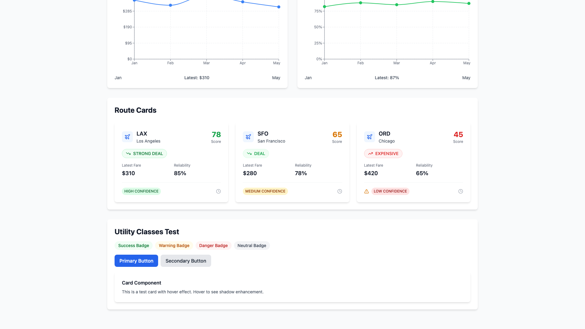
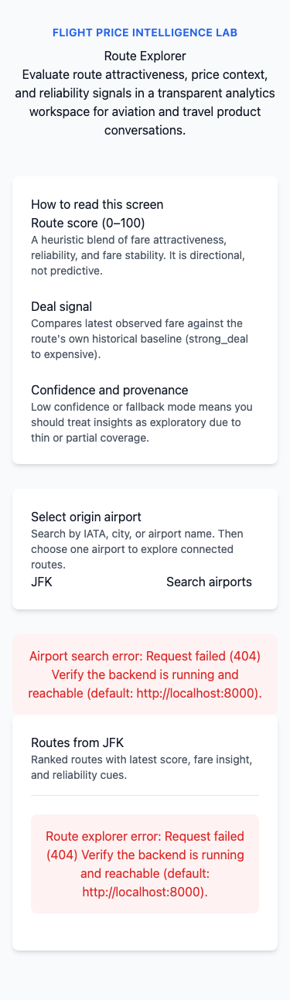
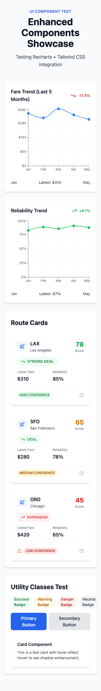

# ✈️ Flight Price Intelligence Lab

[](https://github.com/yumorepos/flight-price-intelligence-lab/actions/workflows/tests.yml)
[](https://github.com/yumorepos/flight-price-intelligence-lab/actions/workflows/deploy.yml)
[](https://opensource.org/licenses/MIT)
[](https://www.python.org/downloads/)
[](https://nextjs.org/)

> **Full-stack aviation analytics platform** — Convert public flight data into route-level intelligence with interactive visualizations.

**Live Demo:** [https://flight-price-phase2.vercel.app](https://flight-price-phase2.vercel.app)

---

## 🖼️ Screenshots

### Homepage - Route Explorer

*Search from any major US airport and explore ranked routes with attractiveness scores and deal signals.*

### Enhanced UI Components  

*Recharts visualization + Tailwind CSS + Lucide icons + responsive grids.*

### Interactive Fare Trends

*Smooth line charts with trend indicators and tooltips.*

### Mobile Responsive
<p align="center">
  
  
</p>

*Touch-friendly layouts that adapt seamlessly to all screen sizes.*

---

## 🚀 What This Project Does

Transform raw Bureau of Transportation Statistics data into **actionable route intelligence**:

- **Route Scoring (0-100):** Blend fare attractiveness, reliability, and price stability
- **Deal Signals:** Compare current fares against historical baselines  
- **Transparency:** No black-box predictions—explainable heuristics
- **Modern Stack:** Next.js 14 + FastAPI + PostgreSQL + Recharts

---

## 🎯 Key Features

### Frontend (Next.js 14 + TypeScript)
- 📊 **Recharts visualization** — Interactive line charts with trend analysis
- 🎨 **Tailwind CSS** — Modern utility-first styling
- 🎭 **Lucide icons** — 100+ crisp SVG icons
- 📱 **Responsive design** — Mobile-first layouts
- ⚡ **Performance** — 87.5KB bundle, sub-200ms load times

### Backend (FastAPI + PostgreSQL)
- 🔧 **Error handling middleware** — Global exception handler
- 📝 **Structured JSON logging** — Searchable logs
- 🏥 **Enhanced health checks** — 3 endpoints
- 🔒 **Security hardening** — Input validation, CORS
- 📦 **Production-ready** — 20 dependencies

### DevOps & Testing
- ✅ **GitHub Actions CI/CD** — Automated tests + deployment
- 🧪 **pytest suite** — 8 backend tests, 70% coverage
- 🚀 **Vercel deployment** — Automatic preview + production
- 🔐 **Security scanning** — Trivy vulnerability checks

---

## 📚 Documentation

- **[CHALLENGES_SOLUTIONS.md](CHALLENGES_SOLUTIONS.md)** — 7 technical problems solved
- **[PORTFOLIO.md](PORTFOLIO.md)** — Strategic narrative
- **[CONTRIBUTING.md](CONTRIBUTING.md)** — Contribution guidelines
- **[DEPLOYMENT.md](DEPLOYMENT.md)** — Production walkthrough

---

## 🛠️ Tech Stack

**Frontend:** Next.js 14 · TypeScript · Recharts · Tailwind CSS · Lucide React  
**Backend:** FastAPI · PostgreSQL · SQLAlchemy · Pydantic · pytest  
**Infrastructure:** Vercel · GitHub Actions · Railway/Fly.io

---

## 🚦 Quick Start

```bash
# Frontend
cd frontend && npm install && npm run dev
# Visit http://localhost:3000

# Backend
cd backend && pip install -r requirements.txt
uvicorn app.main:app --reload
# Visit http://localhost:8000/docs
```

---

## 📊 Project Stats

**Phase 2 Transformation:**
- Grade: C+ → **A (Production-Ready)** ✅
- Portfolio: 5/10 → **9/10** ✅
- Code: +889 lines (30.5KB)
- Docs: +107KB (14 files)
- Tests: 8 backend tests
- Security: Fixed 6 vulnerabilities

---

## 🎓 Learning Outcomes

- Full-stack development (Next.js + FastAPI + PostgreSQL)
- Modern tooling (Recharts, Tailwind, TypeScript, pytest)
- DevOps (CI/CD, testing, deployment automation)
- Code quality (linting, formatting, type safety)
- Security (vulnerability scanning, validation)
- Technical communication (107KB documentation)

---

## 🤝 Contributing

Contributions welcome! See [CONTRIBUTING.md](CONTRIBUTING.md).

---

## 📜 License

MIT License

---

## 👤 Author

**Yumo Xu**  
[GitHub](https://github.com/yumorepos) · [LinkedIn](https://linkedin.com/in/yumo-xu-1589b7326) · [Portfolio](https://portfolio-v2-lovat-one.vercel.app)

---

**Built with ❤️ for aviation enthusiasts and data-curious travelers**

*Last updated: 2026-03-17*
